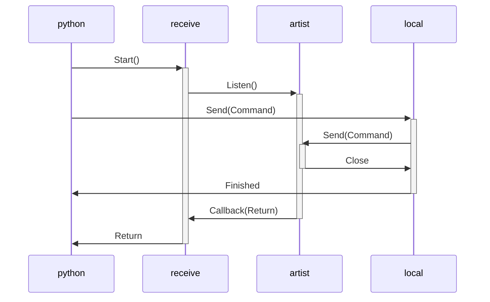

# SaRTist

This Software is a Python remote API for the BAM aRTist software. It consists of an aRTist and a python module.

## Installation
1 ) Clone the repository  
2 ) Install the aRTist module by drag and drop it into the aRTist Window. The `SaRTist module` can be found in the `./build/` folder.  
3 ) Check if the Remote Options in ``Tools`` > ``Settings`` > ``Advanced`` > ``Remote Control`` are enabled. 
The TCP connection must be on ``localhost`` and port: ``3658``. Check your Firewall and whitelist ports 3658, 1234 as well as ip 127.0.0.6
of your localhost.  
4 ) Install the python module in your enviroment.  

## Usage
SaRTist is an API between Python and the TCL console. 
This package uses a socket connection to the `SaRTist module` in aRTist.
The aRTist GUI (or the api!) can be used to adjust all source or detectors settings.
Your Python script can load and manipulate the scene to generate data.
Therefore, utils function in the `SaRTist module` are called.
The usual Python syntax can be used.  
  
  
The following script loads a `.stl` file and moves it to a position:
```python
import sartist as srt


def main():
    path_to_stl = r"C:\\Users\\wittlsn\\Downloads\\Lens-custom-V2.stl"
    name = "Test"

    srt.api.load_stl(path_to_stl, name)
    srt.api.move(1, 40, 3, 20)

if __name__ == "__main__":
    main()
```

To move the source or detector just use:
```python
srt.api.move("S", x_source, y_source, z_source)
srt.api.move("D", x_detector, y_detector, z_detector)
```

A hands-on example of the `SaRTist` package can be found in the examples folder of this repository.  
To control the detector or source use:
```python
source = srt.hardware.ArtistXraySource()
source.voltage_in_kv = 200
```

## Sources and Detectors
To share defined sources and detecors place them in the ``data`` folder. SaRTist copies all sources and detectors to
the aRTist default folders.

## Used TCP Ports:
Python(listen) > TCL = localhost:3658  
Python(send) > TCL = 127.0.0.6: -   
TCL > Python = localhost:1234  


## Connection

    

